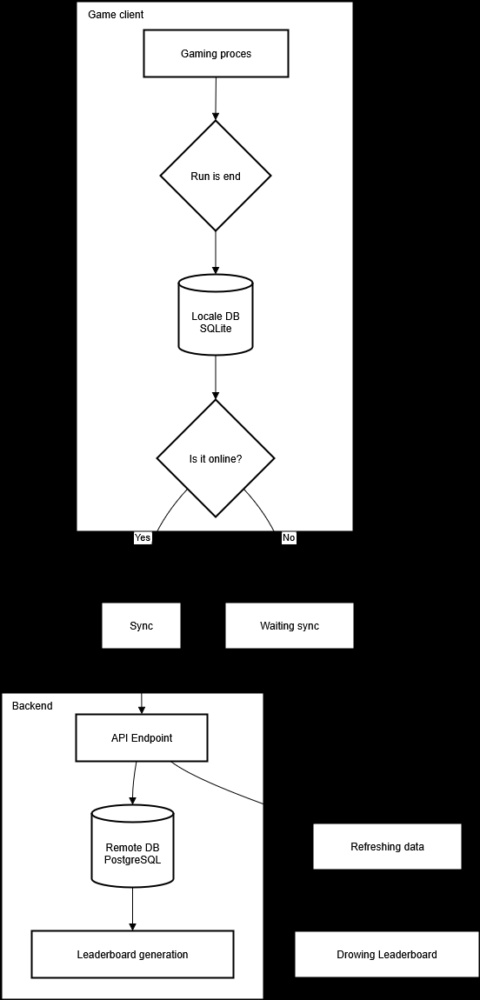

# Py-Rex
This is a small game version of the well-known mini-game from Chrome on Pygame.

## Architecture

### System Components

1.  **Pygame Client**:
    *   Game engine responsible for gameplay.
    *   Local SQLite database manager for storing the player's profile and run results in offline mode.
    *   Synchronization module that sends data to the backend when an internet connection is available.

2.  **Backend Service (Leaderboard Backend)**:
    *   RESTful API (e.g., using Flask/Django/FastAPI) for receiving data from clients.
    *   Central PostgreSQL database for storing all players' profiles and their best results.
    *   Logic for comparing local and remote records and updating the data.

3.  **Databases**:
    *   **SQLite (Local)**: Stores the history of all the user's runs on their device.
    *   **PostgreSQL (Remote)**: Stores the up-to-date, synchronized data of all players for building the global leaderboard.

### Scheme 

